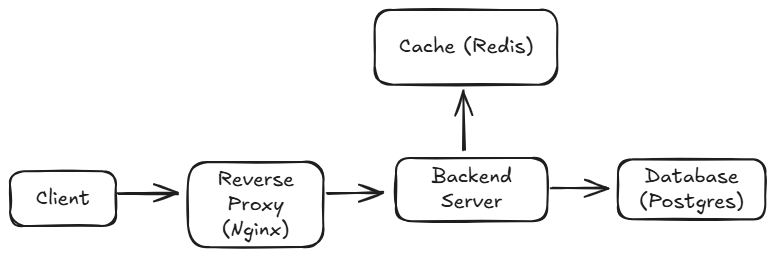

## System architecture

Client makes a request which is proxied to the backend server. The server queries the cached data in redis before making a request to the database

## Scaling plan

- Indexing: Setup proper index based on query pattern in order to improve READ requests
- Caching: Cache data in redis to reduce the workload of the databse
- Horrizontal Scaling: Setup multiple backend servers to distribute workload and improve performance during spike. I would setup an autoscaling group on AWS or whatever platform is used to deploy the server.
- Monitoring and Observability: Include Prometheus and Grafana to monitor the performance of the servers and setup alerts for when specific thresholds are met
- Replication: Add read replicas for the postgres database server.

## Trade-offs

- Use or prisma as opposed to raw SQL adds an abstraction layer in the code but improves developer productivity, schema safety and handles migrations.
- Setting up a reverse proxy adds a layer of complexity to the application but add a layer of security and provides critical features.
- Using postgres instead of a NoSQL database ensures consistency and ACID compliance

## Extensibility

- I would add a user table to the databse to store user data and credentials such as name, password, email e.t.c and introduce stateless authentication (JWT) when users successfully login. I would also setup 2 factor authentication, email and mobile number verification to improve security.
- I would add a reviews table and setup a many to one relationship with the user table and ensure only logged in users can add reviews. I would also ensure reviews do not contain abusive words and profanities.
- I would include a transactions table with a many to one relationship with the user table to store non sensitive payment data such as transaction id and or reference and integrate external payment providers like Stripe and Paystack in order to avoid storing sensitive data. I would setup webhooks to update the status of transactions when a payment is successful.
